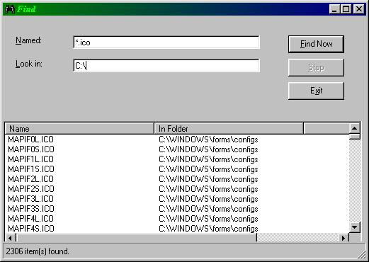



## A Search Engine \-\- Find any file on your computer without using a single API

### Description

This module allows you to find a file or files on your computer without using a single API. It looks for files type that you specific and return their name, path, size and date. It is good for program such as Anti-Virus or any program that requires access to every file in the system. This code also allows you to enter Wild Card Characters "*" so you can search for files of the same type or file(s) that you don't know how to spell.
 
### More Info
 
FindFile(FileToSearch, SearchInDirectory, _

CurrentForm, ListDisplay, _

Optional LabelCurrentDirectory, _

Optional StatusBarCurrentDirectory)

             |
---                |---
**Submitted On**   |2000-06-25 18:32:30
**By**             |[Altis](https://github.com/Planet-Source-Code/PSCIndex/blob/master/ByAuthor/altis.md)
**Level**          |Advanced
**User Rating**    |4.2 (108 globes from 26 users)
**Compatibility**  |VB 3\.0, VB 4\.0 \(16\-bit\), VB 4\.0 \(32\-bit\), VB 5\.0, VB 6\.0, VB Script, ASP \(Active Server Pages\) 
**Category**       |[VB function enhancement](https://github.com/Planet-Source-Code/PSCIndex/blob/master/ByCategory/vb-function-enhancement__1-25.md)
**World**          |[Visual Basic](https://github.com/Planet-Source-Code/PSCIndex/blob/master/ByWorld/visual-basic.md)
**Archive File**   |[CODE\_UPLOAD72086272000\.zip](https://github.com/Planet-Source-Code/altis-a-search-engine-find-any-file-on-your-computer-without-using-a-single-api__1-9312/archive/master.zip)

